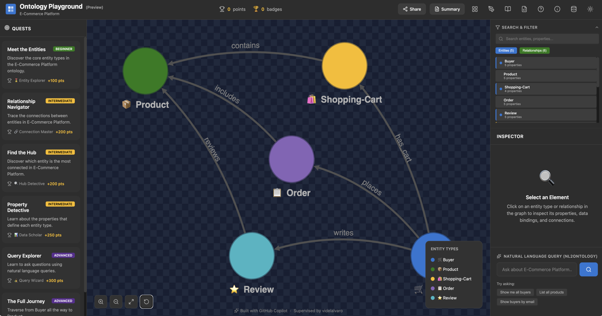

# Ontology Playground（プレビュー）☕

[English](README.md) · [简体中文](README.zh-CN.md) · [日本語](README.ja.md)

> 注：このプロジェクトは AI 支援コーディングを利用して開発されました。

**[ライブ版を試す &#x2192; microsoft.github.io/Ontology-Playground](https://microsoft.github.io/Ontology-Playground/)**

[](https://microsoft.github.io/Ontology-Playground/)

オントロジーと **Microsoft Fabric IQ** について学ぶための、無料で
オープンソースの Web アプリケーションです。既製のオントロジーを調べ、
ビジュアルエディターで独自のものを設計し、RDF/XML としてエクスポートして、
インタラクティブな図を共有できます。バックエンド依存のない完全な
静的サイトだけで、すべての機能を利用できます。


## 機能

### インタラクティブなグラフ探索

Cytoscape.js を利用したグラフが、あらゆるオントロジーをインタラクティブなノードとエッジの図としてレンダリングします。パン、ズーム、ノードのクリックによる
プロパティ確認に加え、ライブ検索バーでエンティティとリレーションシップを絞り込めます。

### オントロジーカタログ

公式およびコミュニティ提供のオントロジーを厳選したライブラリで、六つの
ドメイン（小売、E コマース、医療、金融、製造、教育）を扱います。
カテゴリー別の閲覧、名前やタグによる検索、ワンクリックでの読み込み、
RDF ソースの確認ができます。各オントロジーには共有可能なディープリンク
（`/#/catalogue/official/cosmic-coffee`）があります。

### ビジュアルオントロジーデザイナー

オントロジーを一から作成したり、既存のものを編集したりするための
全画面分割ペインエディターです。アイコン、色、型付きプロパティを持つ
エンティティ型を追加し、カーディナリティ付きのリレーションシップを定義できます。
作業中に更新されるライブグラフプレビューも確認できます。元に戻す/やり直す
（50 段階）、リアルタイム検証、RDF/XML または JSON へのエクスポートを備えます。

### RDF のインポートとエクスポート

RDF/XML（OWL クラス、データ型プロパティ、カーディナリティ付きオブジェクト
プロパティ）の完全な往復変換に対応します。`.rdf` / `.owl` ファイルをインポートし、
Microsoft Fabric IQ が期待する正確な形式でエクスポートし、自動化された
往復テストで忠実性を検証できます。

### ワンクリックのカタログ PR

GitHub（デバイスフロー）でサインインし、デザイナーからコミュニティ
カタログへオントロジーを直接送信できます。アプリがリポジトリを fork し、
ブランチを作成し、RDF とメタデータをコミットして、プルリクエストを自動で開きます。

### 埋め込み可能なウィジェット

自己完結型 JavaScript ファイル（`ontology-embed.js`）で、単一の
`<script>` タグだけで任意の Web ページにインタラクティブな
オントロジービューアーを表示します。ダーク/ライトテーマ、複数の読み込み方法
（カタログ ID、URL、インライン base64）、クリックによる詳細確認に対応します。
詳しくは[埋め込みガイド](docs/embed-guide.md)をご覧ください。

### オントロジースクール

概念学習パスとハンズオンラボを含む **9 コース**から成る、体系的な
学習ハブ（`/#/learn`）です。

- **オントロジーの基礎** — 中核概念を扱う 6 本の記事（オントロジーとは？
  → RDF/OWL → Fabric IQ → 最初のオントロジーを構築 → デザインパターン →
  コントリビューション）
- **7 つのドメイン学習パス** — Fourth Coffee、E コマース、金融、医療、
  製造、大学、HR システム。各パスには、オントロジーを段階的に構築する
  4 本の発展的な記事があり、各段階で追加されたエンティティをライブ埋め込み
  グラフで表示します。
- **IQ ラボ：小売サプライチェーン** — 15 エンティティのオントロジーを
  一から構築する 7 ステップのハンズオンラボ（6 個の発展的カタログ項目を通じて
  3 → 15 エンティティへ拡張）。

すべての記事が**プレゼンテーションモード**（`##` 見出しでスライドを分割）に対応し、
即時フィードバック付きの**インタラクティブクイズ**を含みます。オントロジーの
埋め込みはカタログからライブグラフを読み込み、任意で差分を強調できます。

### クエストシステム

複数ステップの説明、ヒント、進捗バー、実績バッジを備えた五つの段階的クエストが、オントロジーの概念を案内します。

### 自然言語クエリプレイグラウンド

自然言語の質問（「どの顧客が注文しましたか？」）を入力すると、オントロジーのエンティティやリレーションシップにどう対応するか確認できます。
Fabric IQ の NL2Ontology 機能のプレビューです。

### コマンドパレットとキーボードショートカット

どこでも `⌘K` / `Ctrl+K` を押すと、検索可能なコマンドパレットが開きます。
キーボードから離れず、カタログ、デザイナー、オントロジースクール、
インポート/エクスポート、ヘルプなどへ移動できます。`?` を押すとクイックヘルプを
開きます。矢印キーと Enter でパレット内を移動できます。

### スターターテンプレート

デザイナーは五つのドメインテンプレート（小売、医療、金融、IoT、教育）を
提供するため、新規ユーザーが空白ページから始める必要はありません。
各テンプレートは、プロパティ付きの 3 エンティティと 2 リレーションシップを
作成し、すぐにカスタマイズできます。

### インタラクティブなオンボーディングツアー

初回訪問者にはスポットライトオーバーレイ付きの 5 ステップガイドが表示され、
ヘッダー、グラフ、クエスト、インスペクター、デザイナーを順番に強調します。
閉じることができ、「次回から表示しない」設定は `localStorage` に保存されます。

### ディープリンクと URL ルーティング

クライアント側のハッシュルーティングにより、各ページの共有可能な URL を提供します。

| ルート | ページ |
|-------|------|
| `/#/` | ホーム（既定のオントロジー） |
| `/#/catalogue` | オントロジーギャラリー |
| `/#/catalogue/<source>/<slug>` | 特定のオントロジー（例：`/#/catalogue/official/cosmic-coffee`） |
| `/#/designer` | ビジュアルデザイナー |
| `/#/designer/<source>/<slug>` | カタログのオントロジーを読み込んだデザイナー（例：`/#/designer/official/cosmic-coffee`） |
| `/#/learn` | オントロジースクール — コースカタログ |
| `/#/learn/<course>` | コース詳細 — 記事一覧 |
| `/#/learn/<course>/<article>` | 記事ビュー（プレゼンテーションモード付き） |

## 公式オントロジー

| ドメイン | オントロジー | エンティティ | リレーションシップ |
|--------|----------|----------|---------------|
| 小売 | Fourth Coffee | 6 | 7 |
| E コマース | Online Retail | 5 | 6 |
| 医療 | Clinical System | 5 | 6 |
| 金融 | Banking & Finance | 5 | 6 |
| 製造 | Industry 4.0 | 5 | 5 |
| 教育 | University System | 5 | 6 |

## はじめに

### 前提条件

- Node.js 18+
- npm 9+

### インストール

```bash
cd Ontology-Playground
npm install
```

### 開発

```bash
npm run dev
```

http://localhost:5173 にアクセスしてください。

### プロダクションビルド

```bash
npm run build
```

ビルドパイプラインは、カタログと学習コンテンツの Markdown をコンパイルし、
型チェックを行い、アプリをバンドルして埋め込みウィジェットを構築します。
出力先は `build/` です。

### テストの実行

```bash
npm test            # single run
npm run test:watch  # watch mode
```

## デプロイ

### Azure Static Web Apps（主要）

リポジトリには、`main` へのプッシュごとに Azure SWA へデプロイする
GitHub Actions ワークフローが含まれています。

1. Azure Portal で Static Web App を作成します
2. GitHub リポジトリを接続します
3. デプロイトークンをコピーし、GitHub Secret として追加します
   `AZURE_STATIC_WEB_APPS_API_TOKEN_GREEN_PLANT_0BB1D2910`
4. `main` にプッシュします。
   `.github/workflows/azure-static-web-apps-green-plant-0bb1d2910.yml` のワークフローが
   残りを処理します
5. プルリクエストには PR プレビュー環境が自動的に作成されます

### GitHub Pages（fork 向け）

別のワークフローが GitHub Pages へデプロイするため、fork に最適です。

1. このリポジトリを fork します
2. **Settings → Pages → Source** を開き、**GitHub Actions** を選択します
3. `main` にプッシュします。`.github/workflows/deploy-ghpages.yml` のワークフローが
   ビルドし、`https://<username>.github.io/<repo-name>/` へデプロイします

GitHub Pages のビルド中、`VITE_BASE_PATH` 環境変数は自動的に
`/<repo-name>/` に設定され、アセットのパスが正しく解決されます。

### 環境変数

| 変数 | 既定値 | 説明 |
|----------|---------|-------------|
| `VITE_ENABLE_AI_BUILDER` | `false` | Azure OpenAI オントロジービルダーを有効化 |
| `VITE_ENABLE_LEGACY_FORMATS` | `false` | JSON/YAML/CSV のインポート/エクスポート形式を有効化 |
| `VITE_BASE_PATH` | `/` | アプリのベースパス（GitHub Pages では自動設定） |
| `VITE_GITHUB_CLIENT_ID` | *（空）* | ワンクリックのカタログ PR 用 GitHub OAuth App クライアント ID（[設定ガイド](docs/github-oauth-setup.md)） |
| `VITE_GITHUB_OAUTH_BASE` | *（空）* | GitHub Pages デプロイ用の外部 OAuth プロキシ URL（例：Cloudflare Worker URL） |

## プロジェクト構成

```
Ontology-Playground/
├── src/
│   ├── components/       # React components (graph, designer, modals, learn page)
│   ├── data/             # Ontology model, query engine, quest definitions
│   ├── lib/              # Router, RDF parser/serializer, catalogue helpers
│   ├── store/            # Zustand stores (app state, designer state)
│   ├── styles/           # CSS (Microsoft Fluent-inspired dark/light themes)
│   └── types/            # TypeScript type definitions
├── catalogue/            # Official + community ontology RDF files
├── content/learn/        # Course directories with markdown articles, quizzes, and metadata
├── scripts/              # Build-time compilers (catalogue, learning content)
├── api/                  # Azure Functions backend (optional, for AI builder)
├── docs/                 # Guides and documentation
├── public/               # Static assets (compiled catalogue.json, learn.json)
└── .github/workflows/    # CI/CD (Azure SWA + GitHub Pages)
```

## ドキュメント

次の表は、主要なエンドユーザー向けおよびコントリビューター向けガイドの一覧です。内部計画メモ（例：`docs/TODO-*.md`）は、意図的に公開ドキュメント一覧から除外しています。

| ガイド | 説明 |
|-------|-------------|
| [オントロジー作成ガイド](docs/authoring-guide.md) | Playground で適切に動作するオントロジーの作り方 — フィールド別リファレンス、ベストプラクティス、手順解説 |
| [オントロジーを提供：設計から GitHub まで](docs/contributing-ontology-from-design-to-github.md) | エンドツーエンドのコントリビューション手順：設計、RDF エクスポート、メタデータ、ローカル検証、プルリクエスト |
| [Playground 機能デモガイド](docs/playground-features-demo-guide.md) | Playground の主要機能を紹介し、Fabric IQ と Real-Time Intelligence に関連づける手順別デモスクリプト |
| [オントロジースクールのデモガイド](docs/ontology-school-demo-guide.md) | コース、埋め込み、クイズ、プレゼンテーションモード、学習ワークフローのライブデモ計画 |
| [埋め込みガイド](docs/embed-guide.md) | 任意の Web ページへインタラクティブなオントロジーウィジェットを埋め込む方法 |
| [GitHub OAuth セットアップ](docs/github-oauth-setup.md) | ワンクリックのカタログ PR 用に GitHub OAuth を設定する方法 |
| [埋め込みのセキュリティ](docs/embed-security.md) | 埋め込みウィジェットのセキュリティモデル |
| [学習コンテンツガイド](docs/learn-content-guide.md) | オントロジースクール向けのコース、記事、クイズ、オントロジー埋め込みの作成方法 |
| [オントロジースクールのレビューワークフロー](docs/ontology-school-review-workflow.md) | スクールのレッスン内容に対する人手によるレビューと承認フロー |
| [テーマ作成ガイド](docs/theme-authoring-guide.md) | Playground に新しい配色テーマを追加する方法 — トークン契約、appStore と CSS の手順、コントラストの注意点 |

## AI エージェント クイックスタート

このリポジトリには、エージェントが次の処理を確実に行えるようにする Copilot カスタマイズファイルが含まれています。

- 顧客の RDF/OWL をカタログ対応形式へインポート
- 段階的なオントロジースクールモジュールを生成
- レッスン内容を人手によるレビューワークフローへ送る

含まれるアセット：

- スキル：
   - `.github/skills/ontology-catalog-import/` — 外部/顧客 RDF/OWL をカタログ形式へインポート
   - `.github/skills/ontology-school-path-generator/` — 段階的なオントロジースクールモジュールを生成
   - `.github/skills/community-ontology-contribution/` — 適切なディレクトリ構成、メタデータ、検証を使い、`catalogue/community/` にコントリビューターのオントロジーを追加
   - `.github/skills/name-generator/` — 承認済み CSV フィクスチャーから、例、デモ、クエスト、テスト、サンプルデータ用の人名を生成
- RDF 取り込み手順：
   - `.github/instructions/rdf-intake.instructions.md`
- 再利用可能なプロンプト：
   - `.github/prompts/import-rdf-to-catalog.prompt.md`
   - `.github/prompts/generate-ontology-school-module.prompt.md`

マージ前に推奨される検証：

```bash
npm run qa:tutorial-content
npm run build
```

## 技術

- **React 19** + TypeScript 5
- **Cytoscape.js** — グラフ可視化（fcose レイアウト）
- **Zustand** — 状態管理
- **Vite** — ビルドツール
- **Framer Motion** — アニメーション
- **Lucide Icons** — アイコンライブラリ
- **marked** — Markdown コンパイル（ビルド時）

## 詳細情報

- [Microsoft Fabric IQ オントロジーのドキュメント](https://learn.microsoft.com/en-us/fabric/iq/ontology/overview)
- [Azure Static Web Apps](https://docs.microsoft.com/azure/static-web-apps/)

## ライセンス

MIT

## 商標に関する注意

商標：このプロジェクトには、プロジェクト、製品、サービスの商標またはロゴが含まれる場合があります。Microsoft の商標またはロゴの許可された使用は、Microsoft の商標およびブランドガイドラインに従う必要があります。このプロジェクトの変更版で Microsoft の商標またはロゴを使用する場合、混同を招いたり Microsoft の支援を示唆したりしてはなりません。第三者の商標またはロゴの使用には、その第三者のポリシーが適用されます。
