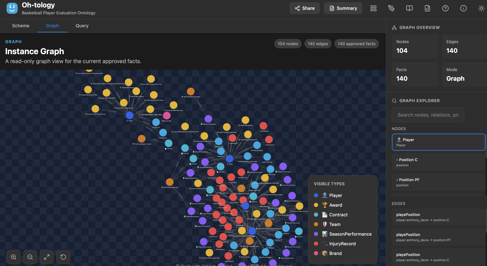
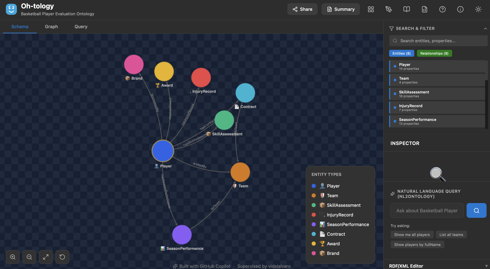
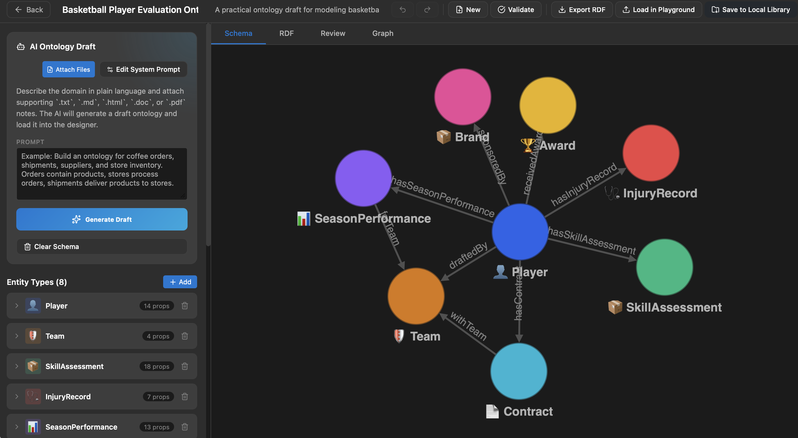
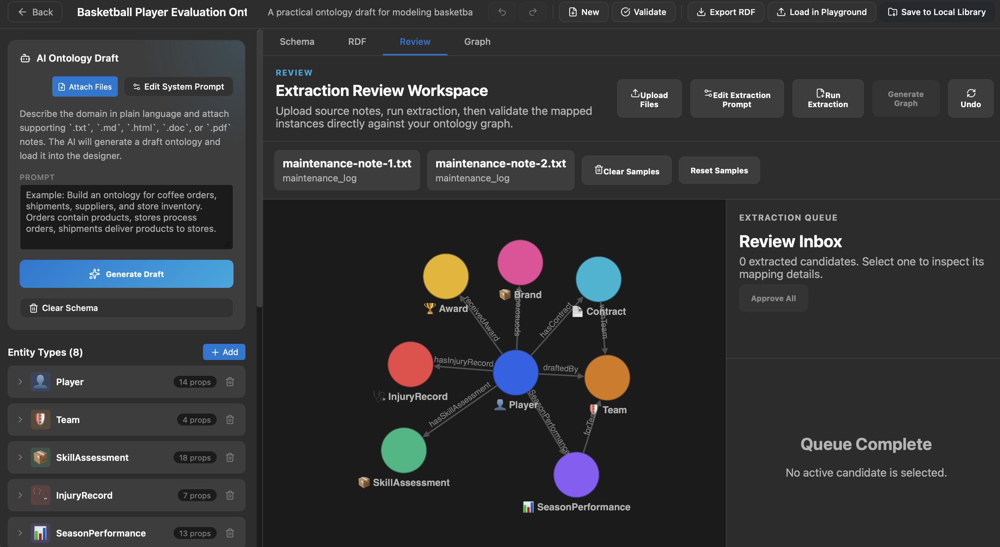
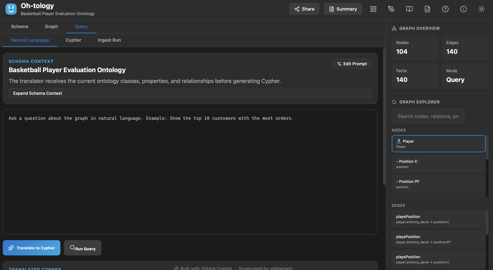

[English](./README.md) | [한국어](./README.ko.md)

# Oh-tology

## 라이브 테스트

**아래 테스트 배포 링크에서 바로 사용하면 됩니다:**

**https://oh-tology-3jch-git-feature-tran-14bc44-woonsangb-5664s-projects.vercel.app/**

이 프리뷰는 지금 바로 테스트 가능한 용도로 열어둔 주소입니다.

중요:

- `Settings` 탭의 `Alignment API Base URL` 기본값은 `https://oh-tology.onrender.com` 입니다.
- AI 기능을 쓰려면 **반드시 API 키 설정이 필요합니다.**
- 테스트 전에 먼저 `Settings`를 열어주세요.
- `Global LLM Mode`에서 `OpenAI` 또는 `Azure OpenAI`를 선택하세요.
- 해당 provider 자격증명이 backend에 이미 없으면, 아래 임시 credential 입력칸에 직접 API 키를 넣어야 합니다.
- 임시 credential과 임시 backend URL은 현재 탭 세션 메모리에만 유지되며, 새로고침하면 사라집니다.

빠른 사용 순서:

1. 위 테스트 링크를 엽니다.
2. `Settings`를 엽니다.
3. `Alignment API Base URL`이 `https://oh-tology.onrender.com` 인지 확인합니다.
4. `OpenAI` 또는 `Azure OpenAI`를 선택합니다.
5. 필요한 API 키 정보를 입력합니다.
6. Diagnostic test 또는 ontology generation을 실행합니다.

로컬에서 온톨로지를 설계하고, 문서 기반 추출 결과를 검토해 그래프로 승인하고, Neo4j에 게시하고 질의할 수 있는 워크스페이스입니다.

[](docs/images/main_graph.png)

## 핵심 기능

- 온톨로지 시각 편집
- AI 기반 온톨로지 초안 생성
- 문서 기반 엔티티/관계 추출 검토
- 승인 결과를 인스턴스 그래프로 생성
- Neo4j 게시 및 Cypher / 자연어 질의
- 온톨로지와 그래프 스냅샷의 로컬 라이브러리 관리

## 제품 흐름

1. 문서나 프롬프트로 온톨로지 초안을 생성합니다.
2. 디자이너에서 엔티티, 속성, 관계를 다듬습니다.
3. 첨부 문서를 현재 온톨로지에 매핑해 추출 후보를 만듭니다.
4. 후보를 검토하고 승인합니다.
5. 승인된 결과를 그래프로 생성합니다.
6. 필요하면 Neo4j에 게시하고 질의합니다.

## 화면 예시

### 메인 스키마 워크스페이스



### AI 온톨로지 초안 생성



### 리뷰 및 그래프 워크플로우



### 자연어 to Cypher



## 저장 구조

```text
Oh-tology/
├── frontend/                     React + Vite 앱
├── backend/                      FastAPI 백엔드
├── vendor/oh-graph-rag/          벤더링된 추출 런타임
├── frontend/library/ontologies/  로컬 온톨로지 스냅샷
├── frontend/library/graphs/      로컬 그래프 스냅샷
├── docs/                         이미지 및 문서
└── RUNNING.md                    짧은 운영 가이드
```

## 로컬 개발 실행

### 요구사항

- Node.js 18+
- npm 9+
- Python 3.10+
- 선택: Neo4j
- 선택: OpenAI 또는 Azure OpenAI 자격증명

### 백엔드

```bash
cd backend
python -m venv .venv310
.venv310/bin/pip install -e .
cp .env.example .env
```

최소 예시:

```env
ALIGNMENT_EXTRACTION_MODE=neo4j_graphrag
ALIGNMENT_LLM_PROVIDER=openai
ALIGNMENT_OPENAI_API_KEY=...
NEO4J_URI=neo4j://localhost:7687
NEO4J_USERNAME=neo4j
NEO4J_PASSWORD=...
NEO4J_DATABASE=neo4j
```

실행:

```bash
cd backend
set -a
source .env
set +a
.venv310/bin/python -m uvicorn app.main:app --reload
```

백엔드: `http://127.0.0.1:8000`

### 프런트엔드

```bash
cd frontend
npm install
VITE_ALIGNMENT_API_BASE_URL=http://127.0.0.1:8000 npm run dev
```

프런트엔드: `http://127.0.0.1:5173`

## Docker 실행

Docker 환경에서는 `.env` 값이 곧 백엔드의 런타임 동작을 결정합니다. 특히 LLM 관련 설정은 `draft generation`, `run extraction`, `natural-language to Cypher`에 모두 영향을 줍니다.

### 로컬 전체 스택

포함 서비스:

- `frontend` on `http://localhost:8080`
- `backend` on `http://localhost:8000`
- `neo4j` on `http://localhost:7474` and `localhost:7687`

실행:

```bash
cp .env.docker.example .env
docker compose up --build
```

기본 `.env.docker.example`은 다음 방향을 가정합니다.

- `ALIGNMENT_EXTRACTION_MODE=auto`
- `ALIGNMENT_LLM_PROVIDER=auto`
- Neo4j는 로컬 컨테이너 사용
- OpenAI 또는 Azure OpenAI 키는 사용자가 직접 채움

권장 절차:

1. `cp .env.docker.example .env`
2. OpenAI를 쓸지 Azure OpenAI를 쓸지 먼저 정합니다.
3. 아래 예시 중 하나만 채웁니다.
4. `docker compose up --build`

확인:

- frontend: `http://localhost:8080`
- backend health: `http://localhost:8000/health`
- Neo4j Browser: `http://localhost:7474`

OpenAI 예시:

```env
ALIGNMENT_LLM_PROVIDER=openai
ALIGNMENT_OPENAI_API_KEY=<openai-api-key>
ALIGNMENT_OPENAI_MODEL=gpt-5.4
```

Azure OpenAI 예시:

```env
ALIGNMENT_LLM_PROVIDER=azure_openai
AZURE_OPENAI_KEY=<azure-openai-key>
AZURE_OPENAI_ENDPOINT=https://<resource>.openai.azure.com/openai/v1
AZURE_OPENAI_DEPLOYMENT=<deployment-name>
```

### 회사 Neo4j에 연결하는 실행

회사 환경에서는 [docker-compose.company.yml](docker-compose.company.yml)을 사용합니다. 이 파일은 로컬 Neo4j 컨테이너를 띄우지 않고, 백엔드가 외부 Neo4j에 직접 연결합니다.

필수 준비물:

- Docker 이미지 tar
- [docker-compose.company.yml](docker-compose.company.yml)
- `.env`
- 권장: `frontend/library/`

`.env` 예시:

```env
NEO4J_URI=bolt://<company-neo4j-host>:7687
NEO4J_USERNAME=<username>
NEO4J_PASSWORD=<password>
NEO4J_DATABASE=neo4j
ALIGNMENT_LLM_PROVIDER=azure_openai
AZURE_OPENAI_KEY=...
AZURE_OPENAI_ENDPOINT=https://<resource>.openai.azure.com/openai/v1
AZURE_OPENAI_DEPLOYMENT=<deployment-name>
```

실행:

```bash
docker compose -f docker-compose.company.yml up -d
```

## LLM 동작 방식

### `ALIGNMENT_LLM_PROVIDER=auto`는 무엇을 보나

`auto`는 성능 테스트나 연결 테스트를 보고 고르지 않습니다. 환경변수 존재 여부만 보고 결정합니다.

- `AZURE_OPENAI_KEY` 또는 `AZURE_OPENAI_API_KEY`
- `AZURE_OPENAI_ENDPOINT`
- `AZURE_OPENAI_DEPLOYMENT`

위 3개가 모두 있으면 `azure_openai`를 사용합니다.

셋 중 하나라도 없으면 `openai`를 사용합니다. 이때 OpenAI 쪽 키는 `ALIGNMENT_OPENAI_API_KEY` 또는 `OPENAI_API_KEY`를 사용합니다.

즉 `auto`는 "가장 잘 되는 provider 자동 선택"이 아니라 "Azure 설정이 완비되면 Azure, 아니면 OpenAI"입니다.

### 각 기능이 어떤 경로를 타는가

- Ontology draft generation:
  `POST /api/ontology/generate-draft`
  OpenAI Responses API의 strict JSON schema 출력을 사용합니다.
- Run extraction:
  `POST /api/graph/generate`
  schema normalization 후 extraction queue를 만듭니다.
- Natural language to Cypher:
  `POST /api/query/translate-cypher`
  strict JSON schema로 `{ cypher, summary, warnings }`를 생성합니다.
- Cypher execution:
  `POST /api/query/neo4j`
  Neo4j에 직접 질의합니다. 이 단계는 OpenAI가 아니라 Neo4j 연결 상태를 탑니다.

### `ALIGNMENT_EXTRACTION_MODE`

- `neo4j_graphrag`
  LLM 기반 extraction을 강제합니다. 키, endpoint, deployment, 런타임 의존성이 맞지 않으면 명확히 실패합니다.
- `auto`
  기본값입니다.
  `neo4j-graphrag` 런타임과 LLM 설정이 모두 준비되면 LLM extraction을 사용합니다.
  그렇지 않으면 heuristic/schema-guided fallback으로 내려갑니다.

즉 `auto`는 가능한 경우 LLM extraction을 쓰되, 설정이 덜 된 환경에서는 완전히 막히지 않도록 fallback을 허용합니다.

### 디버깅 팁

- Draft generation 실패:
  브라우저 Network 탭에서 `/api/ontology/generate-draft` 응답의 `details.error`를 봅니다.
- Run extraction 결과가 단순해 보임:
  `ALIGNMENT_EXTRACTION_MODE`와 LLM env가 실제로 채워졌는지 확인합니다.
- Natural-language to Cypher 실패:
  `/api/query/translate-cypher` 응답의 `details.error`를 확인합니다.
- Cypher 실행 실패:
  `NEO4J_URI`, `NEO4J_USERNAME`, `NEO4J_PASSWORD`, `NEO4J_DATABASE`를 확인합니다.

## Docker 이미지 이관

### 1. Linux `amd64` 이미지 빌드

대상 서버가 일반적인 x86 Linux라면 `linux/amd64`로 빌드하는 것이 안전합니다.

```bash
docker buildx build --platform linux/amd64 -t oh-tology-frontend:latest -f frontend/Dockerfile . --load
docker buildx build --platform linux/amd64 -t oh-tology-backend:latest -f backend/Dockerfile . --load
docker save -o oh-tology-images-linux-amd64.tar oh-tology-frontend:latest oh-tology-backend:latest
```

확인:

```bash
docker image inspect oh-tology-frontend:latest --format '{{.Architecture}}/{{.Os}}'
docker image inspect oh-tology-backend:latest --format '{{.Architecture}}/{{.Os}}'
```

### 2. 옮겨야 하는 파일

실행만 필요하면:

- `oh-tology-images-linux-amd64.tar`
- [docker-compose.company.yml](docker-compose.company.yml)
- `.env`

기존 라이브러리 데이터도 유지하려면 추가:

- `frontend/library/`

### 3. 대상 서버에서 실행

기존 컨테이너가 있으면 먼저 내립니다.

```bash
docker compose -f docker-compose.company.yml down
docker load -i oh-tology-images-linux-amd64.tar
mkdir -p frontend/library/ontologies frontend/library/graphs
docker compose -f docker-compose.company.yml up -d
```

확인:

```bash
docker compose -f docker-compose.company.yml ps
curl http://localhost:8000/health
```

### 4. `scp` 예시

```bash
scp oh-tology-images-linux-amd64.tar user@host:/path/to/deploy/
scp docker-compose.company.yml user@host:/path/to/deploy/
scp .env user@host:/path/to/deploy/
rsync -av frontend/library/ user@host:/path/to/deploy/frontend/library/
```

## 자주 쓰는 명령

### 프런트엔드

```bash
cd frontend
npm run dev
npm test
npm run build
npm run lint
```

### 백엔드

```bash
cd backend
.venv310/bin/pytest tests/test_api.py -q
```

## 주요 환경변수

### 프런트엔드

| Variable | Description |
| --- | --- |
| `VITE_ALIGNMENT_API_BASE_URL` | FastAPI backend base URL |
| `VITE_ENABLE_AI_BUILDER` | AI ontology draft UI toggle |
| `VITE_BASE_PATH` | Vite base path |
| `VITE_GITHUB_CLIENT_ID` | GitHub OAuth client id |
| `VITE_GITHUB_OAUTH_BASE` | External OAuth proxy base |

### 백엔드

| Variable | Description |
| --- | --- |
| `ALIGNMENT_EXTRACTION_MODE` | `auto` or `neo4j_graphrag`; `auto` uses LLM extraction only when runtime + LLM config are ready |
| `ALIGNMENT_NEO4J_GRAPHRAG_SRC` | Optional source override |
| `ALIGNMENT_LLM_PROVIDER` | `auto`, `openai`, `azure_openai`; `auto` prefers Azure only when all Azure env vars are present |
| `ALIGNMENT_OPENAI_API_KEY` | OpenAI API key |
| `OPENAI_API_KEY` | OpenAI fallback env |
| `ALIGNMENT_OPENAI_MODEL` | OpenAI model |
| `ALIGNMENT_OPENAI_BASE_URL` | Optional OpenAI-compatible base URL |
| `ALIGNMENT_OPENAI_ORGANIZATION` | Optional OpenAI org |
| `ALIGNMENT_OPENAI_PROJECT` | Optional OpenAI project |
| `AZURE_OPENAI_KEY` | Azure OpenAI key |
| `AZURE_OPENAI_API_KEY` | Azure OpenAI key alias |
| `AZURE_OPENAI_ENDPOINT` | Azure OpenAI OpenAI-compatible base URL, ideally ending with `/openai/v1` |
| `AZURE_OPENAI_DEPLOYMENT` | Azure deployment name |
| `ALIGNMENT_OPENAI_TIMEOUT_SECONDS` | LLM request timeout seconds |
| `ALIGNMENT_LLM_TEMPERATURE` | Extraction temperature |
| `ALIGNMENT_EXTRACTION_MAX_CONCURRENCY` | Extraction concurrency |
| `NEO4J_URI` | Neo4j URI |
| `NEO4J_USERNAME` | Neo4j username |
| `NEO4J_PASSWORD` | Neo4j password |
| `NEO4J_DATABASE` | Neo4j database |

## 참고

- [RUNNING.md](RUNNING.md)
- [backend/README.md](backend/README.md)
- [frontend/README.md](frontend/README.md)

## 벤더링 의존성

`vendor/oh-graph-rag/`는 추출 런타임의 벤더링 복사본입니다. 업데이트 시 라이선스와 notice 파일을 유지해야 합니다.
