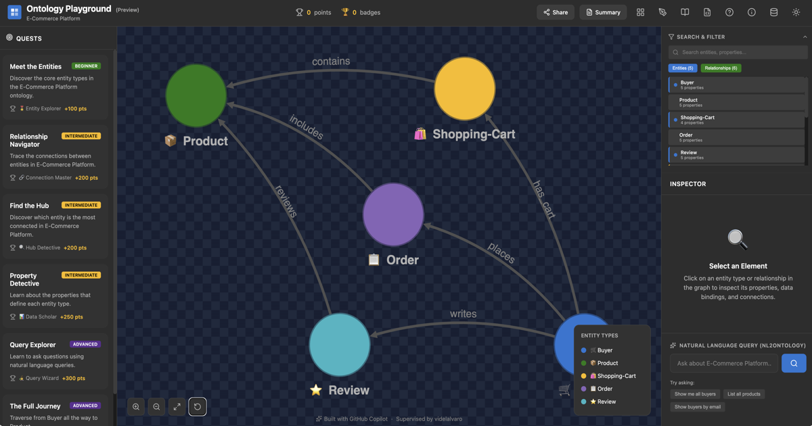

# Oh-tology

> Local ontology design, extraction review, graph curation, and Neo4j publishing workspace.

[](frontend/public/og-image.png)

Oh-tology is a full local workspace for:

- designing ontologies in a visual editor
- generating draft ontologies from AI-assisted prompts
- extracting review candidates from source documents
- approving facts into an instance graph
- translating natural language into Cypher
- publishing approved graphs into Neo4j
- keeping ontology and graph snapshots under version control


## What It Includes

### Main workspace

The main app combines:

- a schema graph view
- an approved graph view
- a Neo4j query console
- right-side schema or graph-aware inspection panels
- RDF/XML editing and ontology exploration tools

### Designer and review flow

The designer provides a full editing surface for entity types, properties,
relationships, cardinalities, icons, and colors. The same environment also
hosts the review workflow for extraction candidates, so ontology iteration and
fact review happen in one place.

### Extraction workflow

The backend can project a user-authored ontology into:

- a normalized schema summary
- a candidate review queue
- a graph projection used by the review UI

Two extraction lanes exist today:

- `auto` for lightweight local heuristic extraction
- `neo4j_graphrag` for OpenAI-backed graph extraction through the vendored
  `oh-graph-rag` runtime

### Graph publishing and querying

Approved facts can be turned into an instance graph, previewed, and published
to Neo4j with an `ingest_run_id`. The query tab supports:

- raw Cypher execution
- `ingest_run_id` scoped queries
- natural-language-to-Cypher translation using the current ontology context
- editable translator system prompts

### Local content library

The repository stores ontology and graph artifacts directly under:

- `frontend/library/ontologies/`
- `frontend/library/graphs/`

These are intended to be committed, shared, and reused.

## Screenshots

### Main workspace


The main workspace combines the approved graph canvas, graph-aware right-side
inspection panels, and the top-level schema / graph / query navigation in one
surface.

## Repository Layout

```text
Oh-tology/
├── frontend/                    React + Vite application
├── backend/                     FastAPI workflow backend
├── vendor/oh-graph-rag/         Vendored graph extraction dependency
├── frontend/library/ontologies/ Local ontology snapshots
├── frontend/library/graphs/     Local graph snapshots
├── docs/                        Project documentation
└── RUNNING.md                   Short operational runbook
```

## Key Features

### Visual ontology authoring

- edit ontology classes and relationships directly in the browser
- tune property types, identifiers, icons, and colors
- inspect the schema as a live graph while editing
- export/import RDF/XML and JSON-backed ontology structures

### Review and approval

- generate graph candidates from source documents
- inspect candidate evidence and suggested mappings
- approve, reject, or defer candidate facts
- produce an approved instance graph from reviewed facts

### Natural-language query translation

- ask questions in plain language from the query tab
- inspect the schema context used for translation
- review the generated Cypher before execution
- override the translator system prompt from a modal editor
- execute the translated query directly against Neo4j

### Neo4j integration

- preview publish counts before writing
- publish nodes and relationships with `ingest_run_id`
- query the published graph from the same UI
- inspect how the live database schema differs from ontology-only schema

## Getting Started

### Prerequisites

- Node.js 18+
- npm 9+
- Python 3.10+
- optional: local Neo4j instance for publish/query features
- optional: OpenAI API key for AI ontology generation, `neo4j_graphrag`
  extraction, and natural-language query translation

## Backend Setup

```bash
cd backend
python -m venv .venv310
.venv310/bin/pip install -e .
cp .env.example .env
```

Edit `backend/.env` and set at least the values you need:

```env
ALIGNMENT_EXTRACTION_MODE=neo4j_graphrag
ALIGNMENT_OPENAI_API_KEY=...
NEO4J_URI=neo4j://localhost:7687
NEO4J_USERNAME=neo4j
NEO4J_PASSWORD=...
NEO4J_DATABASE=neo4j
```

Run the backend:

```bash
cd backend
set -a
source .env
set +a
.venv310/bin/python -m uvicorn app.main:app --reload
```

Backend will be available at `http://127.0.0.1:8000`.

## Frontend Setup

```bash
cd frontend
npm install
VITE_ALIGNMENT_API_BASE_URL=http://127.0.0.1:8000 npm run dev
```

Frontend will be available at `http://127.0.0.1:5173`.

## Common Development Commands

### Frontend

```bash
cd frontend
npm run dev
npm test
npm run build
npm run lint
```

### Backend

```bash
cd backend
.venv310/bin/pytest tests/test_api.py -q
```

## End-to-End Workflow

1. Start the backend and frontend.
2. Open the main workspace and inspect or load an ontology.
3. Move into the designer to edit or generate a draft ontology.
4. Add source documents in the review flow and run extraction.
5. Review the candidate queue and approve valid facts.
6. Build the approved instance graph.
7. Preview or publish that graph to Neo4j.
8. Query the published graph with raw Cypher or natural language.

## Environment Variables

### Frontend

| Variable | Description |
| --- | --- |
| `VITE_ALIGNMENT_API_BASE_URL` | Base URL for the FastAPI backend |
| `VITE_ENABLE_AI_BUILDER` | Enables the AI ontology draft builder UI |
| `VITE_BASE_PATH` | Vite base path for non-root deployments |
| `VITE_GITHUB_CLIENT_ID` | GitHub OAuth client id if catalogue PR automation is used |
| `VITE_GITHUB_OAUTH_BASE` | Optional external OAuth proxy for static deployments |

### Backend

| Variable | Description |
| --- | --- |
| `ALIGNMENT_EXTRACTION_MODE` | `auto` or `neo4j_graphrag` |
| `ALIGNMENT_NEO4J_GRAPHRAG_SRC` | Optional source override for the vendored graphrag package |
| `ALIGNMENT_LLM_PROVIDER` | Currently `openai` |
| `ALIGNMENT_OPENAI_API_KEY` | OpenAI key for extraction, draft generation, and query translation |
| `OPENAI_API_KEY` | Standard fallback OpenAI env var |
| `ALIGNMENT_OPENAI_MODEL` | Model name used by OpenAI-backed flows |
| `ALIGNMENT_OPENAI_BASE_URL` | Optional OpenAI-compatible base URL |
| `ALIGNMENT_OPENAI_ORGANIZATION` | Optional OpenAI org id |
| `ALIGNMENT_OPENAI_PROJECT` | Optional OpenAI project id |
| `ALIGNMENT_LLM_TEMPERATURE` | Temperature for extraction-oriented flows |
| `ALIGNMENT_EXTRACTION_MAX_CONCURRENCY` | Extraction concurrency limit |
| `NEO4J_URI` | Neo4j connection string |
| `NEO4J_USERNAME` | Neo4j username |
| `NEO4J_PASSWORD` | Neo4j password |
| `NEO4J_DATABASE` | Neo4j database name |

## Main Routes and Surfaces

### Main app

- `/` or `/#/` for the primary workspace
- query tab for Cypher and NL-to-Cypher translation
- graph tab for approved graph inspection

### Designer and review

- `/#/designer`
- `/#/review-graph`
- `/#/alignment` compatibility route

### Learning and catalogue

- `/#/catalogue`
- `/#/learn`

## Current Implementation Notes

- the backend currently uses an in-memory repository for workflow state
- publish/query features operate against a live Neo4j instance
- natural-language query translation is grounded in ontology context and now
  also consults a live Neo4j schema snapshot when available
- mismatches between ontology definitions and already-published Neo4j data can
  still produce surprising query results until the graph is republished

## Documentation

- [RUNNING.md](RUNNING.md) for a shorter operational runbook
- [backend/README.md](backend/README.md) for backend-specific behavior and env vars
- [frontend/README.md](frontend/README.md) for the richer frontend feature overview

## Vendored Dependency

`vendor/oh-graph-rag/` contains a vendored copy of the graph extraction
runtime. Keep upstream notices and licensing files intact when updating it.
